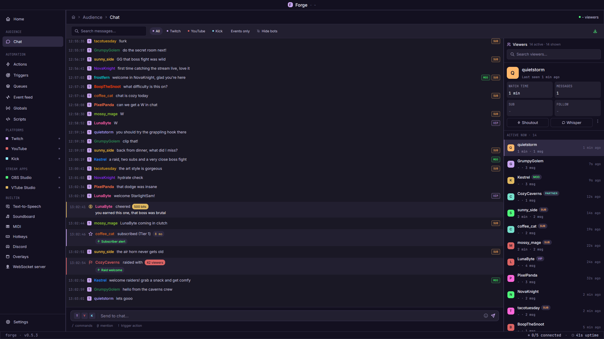
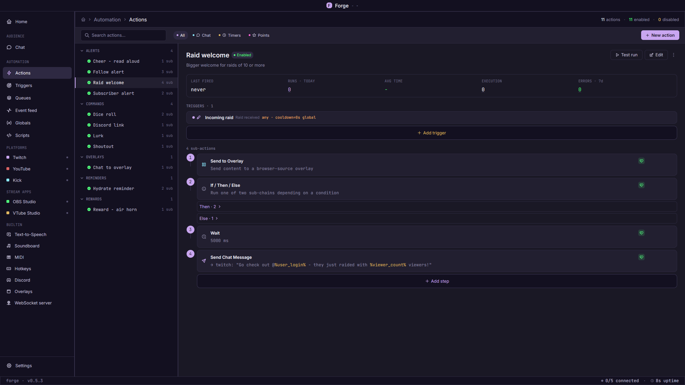
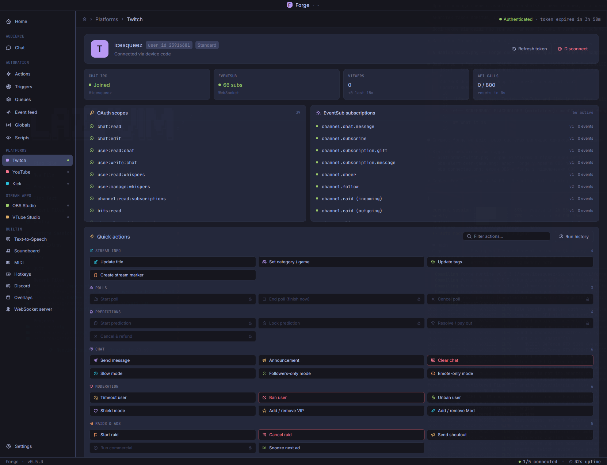
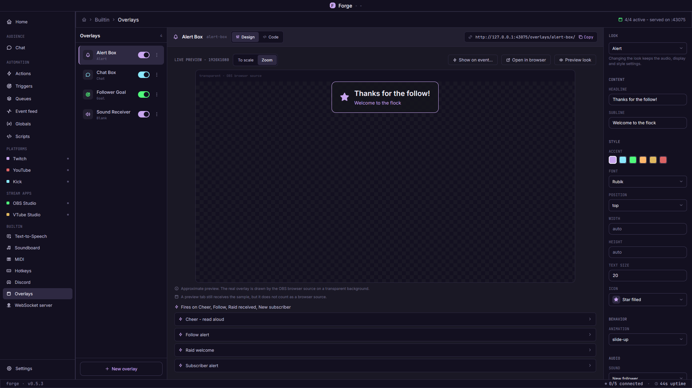
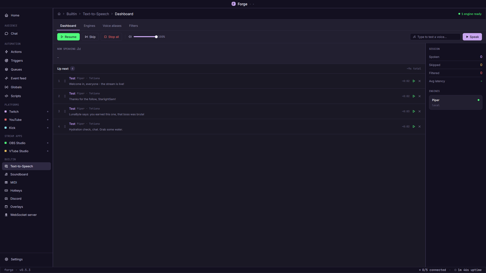
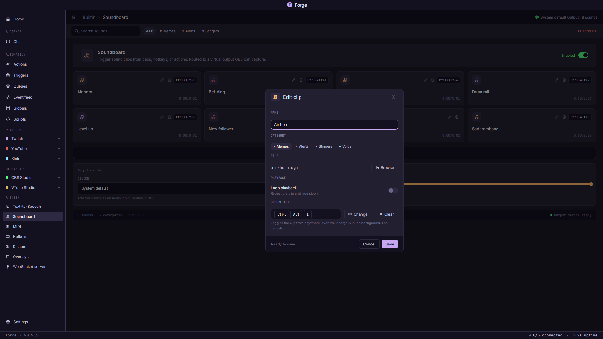
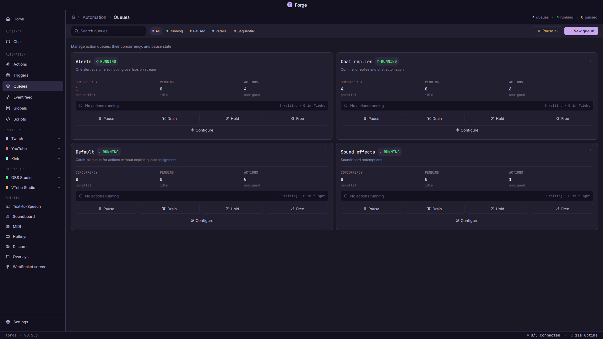
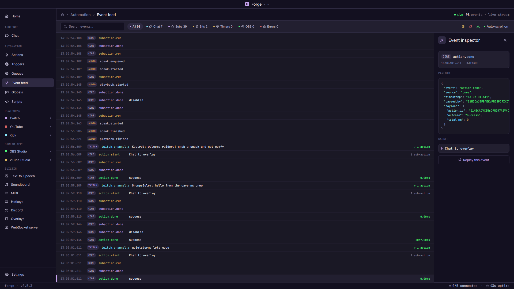
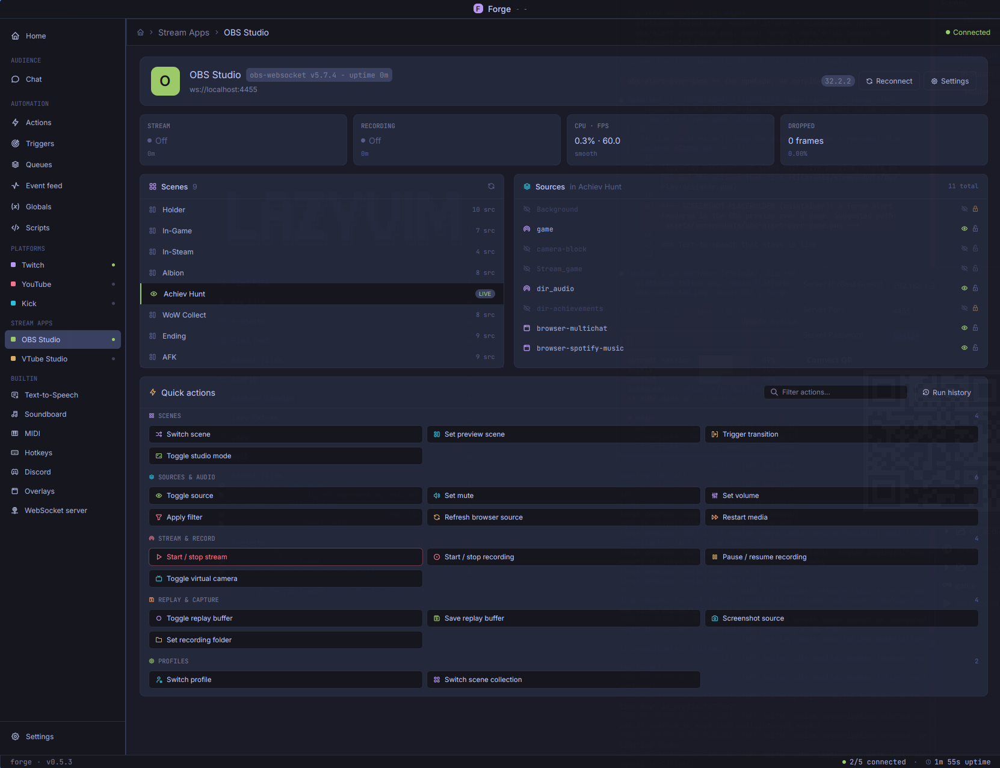

# forge

**Your stream on autopilot.** Chat, alerts, voices and sounds from Twitch, YouTube, Kick and OBS, wired together in one local desktop app.

[](./LICENSE)
[](https://www.rust-lang.org/)
[](#install)

[](https://github.com/IceSqueez/forge/releases)
[](https://github.com/IceSqueez/forge/releases)
[](https://github.com/IceSqueez/forge/actions/workflows/release.yml)
[](https://github.com/IceSqueez/forge/actions/workflows/nightly.yml)

[](https://github.com/IceSqueez/forge/commits/main)
[](https://github.com/IceSqueez/forge/issues)
[](https://github.com/IceSqueez/forge/pulse)
[](https://github.com/IceSqueez/forge/releases)




## What it is

forge is a desktop app that listens to everything happening on your stream (a follow, a raid, a cheer, a chat command, an OBS scene change, a MIDI pad, a hotkey) and runs the actions you built for it: post in chat, switch a scene, pop an alert, read a message aloud, fire an air horn. Text-to-speech, browser-source overlays and a soundboard are built in, so one app replaces a stack of tools.

It runs on your machine, needs no account of its own, and is open source under MIT OR Apache-2.0. Linux, Windows and macOS.

## Highlights

### Build reactions without writing code

Pick a trigger, stack steps, done. Steps nest: if/else branches, loops, switch/case, waits, other actions. Every step can use the event's data (`%user_login%`, `%viewer_count%`), and **Test run** fires the action through the exact path a real event takes, so what you test is what goes live. When plain steps are not enough, drop in a sandboxed [rhai](https://rhai.rs) script.



### Every chat, one window

Twitch, YouTube and Kick land in one live feed (the screenshot at the top), with platform filters, search, badges and emotes. Subs, cheers and raids show inline together with the action they fired. Click a viewer to see watch time and message count, or shout them out on Twitch.



### Alerts that talk, straight into OBS, no audio cable

Design an alert, ticker, goal bar, frame or chat box, copy its URL into an OBS browser source, and let any action send content to it. An overlay can carry a sound and a line of speech: the alert appears exactly when its audio starts and stays until the speech ends. The sound plays **inside the browser source**, so OBS on another PC hears it with no virtual cable or desktop-audio capture. Your TTS and soundboard can be routed the same way.




### Text-to-speech that stays in line

Offline engines (Piper, eSpeak NG, the OS voice on Windows and macOS) or bring your own key for Azure, OpenAI, ElevenLabs or Amazon Polly. Give each viewer a voice, filter links and blocked words before anything is spoken, cap message length, and let auto-detect pick a voice in the message's language. The queue is yours: pause, skip, reorder by drag, replay the last line, or let it **hold automatically while you are talking** into your mic.



### A soundboard on global keys

Drop in clips (wav, mp3, ogg, flac, m4a), give each one a key combo, and press it from inside your game: the combo works while forge is in the background. Per-clip volume and output device, a master volume, loop playback, and the same clips are playable from any action or channel-point reward.



### Queues that keep alerts from colliding

Every action runs on a queue. One-at-a-time for alerts so nothing overlaps on stream, parallel for chat replies. Pause, Drain, Hold or Free a queue with one click when things get hectic.



### See exactly what happened, then replay it

The event feed shows every event, every action start and finish, and every step, with timings. Inspect the full payload, follow which event caused which action, and hit **Replay this event** to test an alert again without waiting for a real raid.



### Also inside

- **OBS** control and triggers over obs-websocket: scenes, sources, audio, recording and streaming, filters, and 47 kinds of OBS events.
- **VTube Studio**, **MIDI** controllers (with MIDI Learn), **Discord** webhooks and **global hotkeys** (including hold-to-talk style press and release).
- **Globals**: counters and values that survive restarts, usable everywhere.
- **WebSocket + HTTP server** for your own dashboards and companion tools.
- **English and Ukrainian** interface.



<details>
<summary><b>Full trigger and integration catalogue</b></summary>

### Chat platforms

- **Twitch**
  - Triggers: chat (commands, messages, cheers), shared chat, subs/resubs/gift subs, follows, raids (received and sent), channel-point redemptions (custom and automatic) and reward changes, polls, predictions, hype train, charity, goals, moderation (ban/timeout/unban, mod add/remove, shield mode, suspicious users, warning acknowledged), shoutouts (sent and received), guest star, ad break, automod, stream online/offline, channel and chat-settings updates
  - Sub-actions: send chat/reply/announcement/whisper, ban/timeout/unban/warn, mod and VIP management, shoutout, start/cancel raid, run/snooze ad, poll and prediction lifecycle, reward management and redemption fulfillment, automod approve/deny/terms, update title/category/tags, stream marker, get current goal, guest star and shield mode control, chat clear and message delete
- **YouTube** (live-chat polling)
  - Triggers: chat message, chat command, Super Chat, Super Sticker, message deleted, new member, member milestone, membership gift (mass) and gift received, stream online/offline, stream title changed, user banned/timed out
  - Sub-actions: send/delete chat message, ban/timeout/unban user, add/remove moderator, update stream title/description/category/privacy
- **Kick** (see the note below)
  - Triggers: chat message, chat command, message deleted, new subscriber, subscription gift, host received, ban, livestream status, livestream metadata, reward redeemed
  - Sub-actions: send/delete chat message, ban/timeout/unban user, update channel title/category/tags, reward create/update/delete, redemption accept/reject

Chat triggers carry a permission level (everyone, subscriber, VIP, moderator, broadcaster) and a cooldown (per user or global).

### Stream apps and devices

- **OBS Studio** (obs-websocket v5): 47 triggers (scenes, sources, audio, recording, streaming, transitions, filters, studio mode, virtual camera, connection) and 39 sub-actions (switch scene, source visibility, mute/volume, start/stop/pause recording and streaming, filters, browser-source refresh, media restart, screenshots, profiles and scene collections, raw requests)
- **VTube Studio**: 9 triggers (model loaded, tracking status, hotkey/expression/item events) and 18 sub-actions (hotkeys, expressions, parameters, model load/move/scale, color tint, physics, items)
- **MIDI**: note on/off, control change, pitch bend, program change, device connected/disconnected; a `midi.send` sub-action for output
- **Global hotkeys**: key pressed and key released triggers, so one combo can start something on press and stop it on release
- **Discord** (webhooks, outbound only): post text, post embed, edit message, send file, delete message

### Built-in sub-actions

- **Flow control**: if/then/else, loops (count, for-each, while), switch/case, break/continue, stop, delay (fixed or wait-until)
- **Action and trigger control**: run or cancel another action, enable/disable/toggle actions and triggers
- **Globals and variables**: set, get, increment, decrement, toggle, array append/remove; per-user values; run-scoped variables
- **Strings, math, random, date and time**
- **Files** (sandboxed): read, write/append, delete, list
- **HTTP**: GET, POST, PUT, PATCH, DELETE with headers, query, body and JSON/text parsing
- **Queues**: pause, resume, clear
- **Desktop**: notification, clipboard, open URL
- **TTS**: speak, stop, pause/resume/skip/clear queue, set/switch voice alias
- **Soundboard**: play, stop, stop all, master volume
- **Scripts**: run inline rhai, run a saved script, emit a custom event
- **Overlays and server**: send to an overlay (optionally wait for the show to finish), broadcast to connected WebSocket clients

### Overlays

Looks: Alert, Ticker, Frame, Goal, Chat, Blank (sound or speech only). Each overlay is served at `http://<host>:<port>/overlays/<id>/`; renaming it never changes that URL. Markup, style and script are editable per overlay.

### Text-to-speech

- Local: Piper, eSpeak NG (both installed separately and run as their own process), the system voice on Windows (SAPI) and macOS (AVSpeech)
- Cloud, with your own API key: Azure, OpenAI, ElevenLabs, Amazon Polly
- Voice per viewer, filters (replace, blocklist, links, max length, cut-off after N seconds), auto language detection, voice gate on your mic

### Server

WebSocket API at `/ws/v1/` with bearer-token auth and event subscriptions, plus sandboxed HTTP hosting for overlays.

</details>

> **About Kick.** Kick is a hybrid integration: sign-in (OAuth) and everything forge *sends* (chat, moderation, channel and reward changes) go through Kick's official API. Kick offers no official way for a desktop app to *receive* chat, so incoming chat arrives over Kick's unofficial WebSocket, which can change or break without notice. forge shows this notice on every Kick screen.

## Install

Download from [GitHub Releases](https://github.com/IceSqueez/forge/releases). Each file has a matching `.sha256` checksum.

| Platform | File |
| :--- | :--- |
| Linux x64 | `.AppImage` (portable), `.deb` (Debian / Ubuntu), `.rpm` (Fedora / RHEL / openSUSE) |
| Windows x64 | `.msi` (installer) or `.exe` (portable) |
| macOS (Apple Silicon + Intel) | universal `.dmg` |

**macOS:** the app is not notarized, so Gatekeeper warns about an unverified developer. After dragging Forge to Applications, run:

```bash
xattr -dr com.apple.quarantine /Applications/Forge.app
```

forge keeps its data in your user data folder (`~/.local/share/forge` on Linux, `%APPDATA%\forge` on Windows, `~/Library/Application Support/com.icesqueez.forge` on macOS). Set `FORGE_DATA_DIR` to use another folder.

## Build from source

Rust is pinned in `rust-toolchain.toml` (currently 1.98.1); [rustup](https://rustup.rs/) installs it on first build.

On Debian / Ubuntu, install the system libraries first:

```bash
sudo apt-get install build-essential pkg-config libwayland-dev libxkbcommon-dev \
  libxkbcommon-x11-dev libgl1-mesa-dev libx11-dev libasound2-dev libdbus-1-dev libfontconfig1-dev
```

Then:

```bash
git clone https://github.com/IceSqueez/forge.git
cd forge
cargo build --release
./target/release/forge
```

## Contributing

Bug reports and pull requests are welcome on [GitHub](https://github.com/IceSqueez/forge/issues).

## License

Licensed under either of [MIT](./LICENSE-MIT) or [Apache 2.0](./LICENSE-APACHE), at your option.
